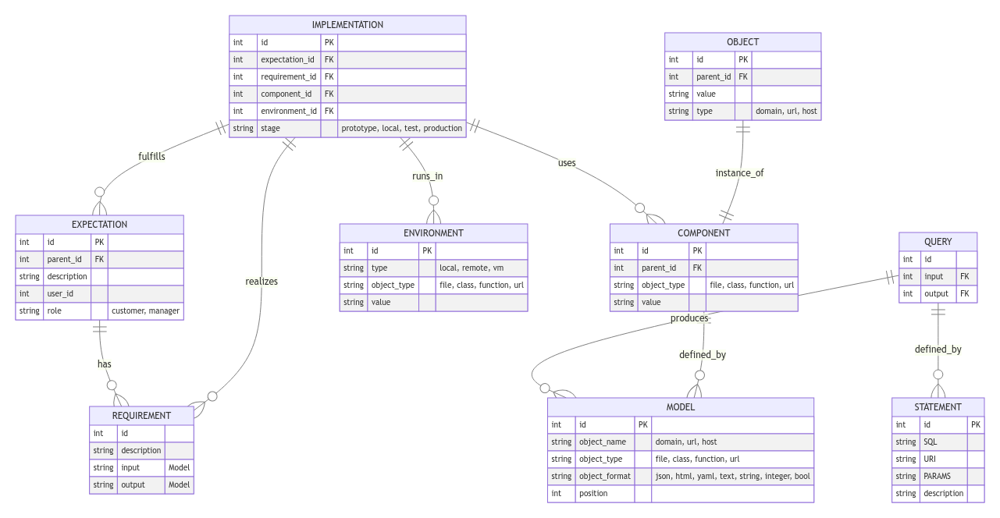

# Hi level solution

## DB structure

### Service Specification

+ Expectation
  + id
  + parent_id
  + description
  + user_id:
  + role: customer, manager

+ Requirements
  + id
  + description
  + input: Model
  + output: Model
    
+ Component
  + id
  + parent_id
  + object_type: file, class, function, url
  + value

+ Environment
  + id
  + type: local, remote, vm  
  + object_type: file, class, function, url
  + value

  
+ Implementation
  + id
  + Expectation_id
  + Requirements_id
  + Component_id
  + Environment_id
  + Stage: prototype, local, test, production

  
### Service Implementation

+ Object
  + id
  + parent_id
  + value    
  + Type: domain, url, host, 
  
+ Query
  + id
  + input: Statement_id    
  + output: view_id
  

### Adapter API

+ Model
  + id
  + object_name: domain, url, host, 
  + object_type: file, class, function, url
  + object_format: json, html, yaml, text, string, integer, bool
  + position

    
+ Statement
  + id
  + SQL
  + URI
  + PARAMS
  + description

## How to use?

### Build Prototype
+ Preparing specification based on customer **expectations**
+ Creating **Requirements** based on customer **expectations**
+ Creating **Component** based on **Requirements** defined based on the customer **expectations**

### Run Prototype

+ SELECT query on **Implementation** table to get the the list of **Components** necessary to deploy the code

### Customer usage

+ ask for **Object** through select query
+ INSERT the question to **Query**
+ as output show the thete through **View** template
